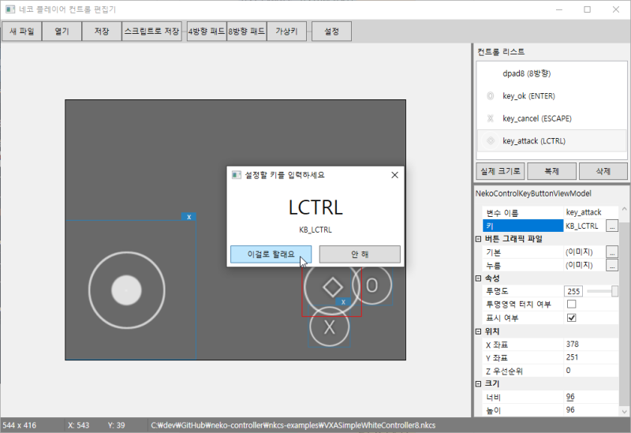

# NekoControlEditor [archived]

This Editor creates and edits Virtual controls (eg. Direction-Pad, Trigger Button) which are usable on Android RPG Maker Game Emulator: *Neko Player*.

Since *Neko Player* **is no longer available** (R.I.P), now I uncover this repository to public, and NEVER UPDATE.

## Packages
* Extended.Wpf.Toolkit.3.8.1
* Newtonsoft.Json.12.0.3
* WindowsAPICodePack-Core.1.1.1
* WindowsAPICodePack-Shell.1.1.1

## Manual Document (Korean Only)
https://github.com/jubin-park/neko-controller
